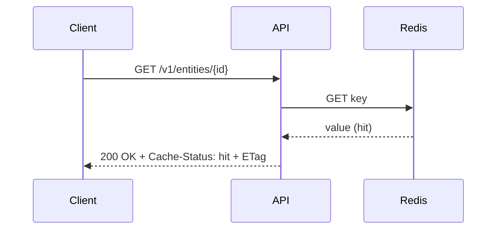
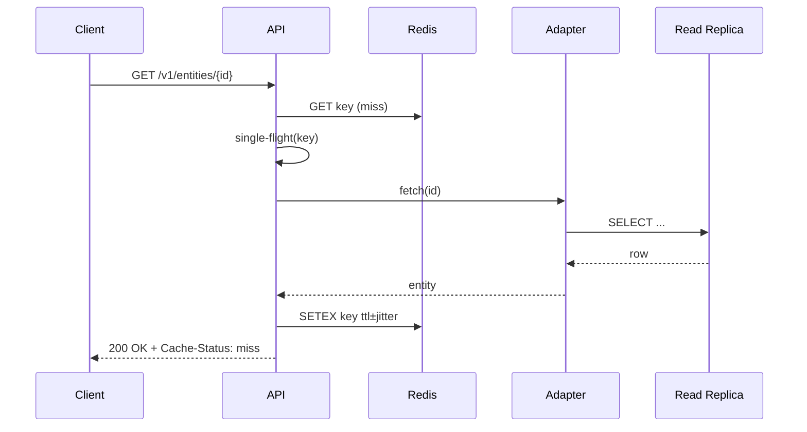
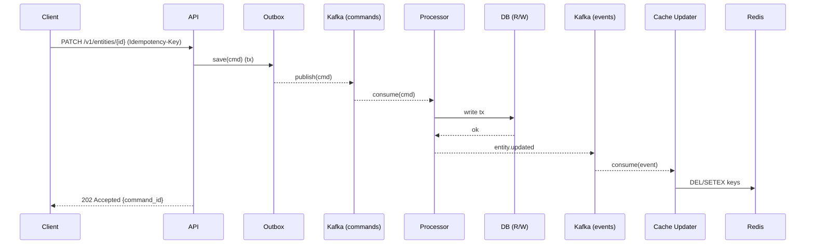
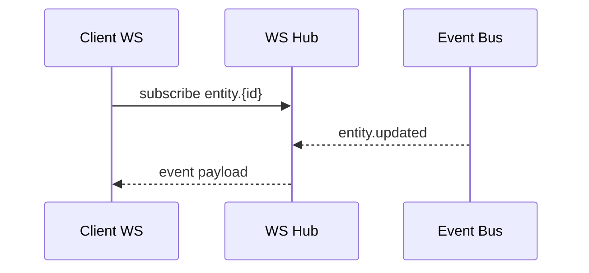

# Universal Middleware / Platform Layer — RFC (Print‑Ready)

> **Status:** Draft v1  
> **Owner:** Principal Solution Architect  
> **Date:** 2025‑10‑22  
> **Applies to:** AWS/Azure/GCP/on‑prem (K8s fallback)  
> **Inputs to fill:** `<P50_ms>`, `<P95_ms>`, `<rps_steady>`, `<rps_burst>`, `<availability_target>`, `<monthly_budget>`, `<gdpr/hipaa/sox/etc>`, `<rto>`, `<rpo>`, `<domain_examples>`, `<qps>`, `<events_per_sec>`, `<read_pct>/<write_pct>`, `<postgres/mysql/mongo/elasticsearch/...>`, `<regions>`, `<langs/runtime familiarity>`

---

## 1) Executive Summary (one page)

**Objective.** Decouple clients from data stores and cut DB load by deploying a **cache‑first, event‑driven middleware** that exposes a consistent API façade (REST + optional GraphQL/gRPC) with real‑time updates.

**Approach.**
- **CQRS** split: cache/read‑models for reads; **commands → outbox → processors** for writes.  
- **Redis** (or equivalent) is the first hop for reads; **Kafka** (or equivalent) is the event backbone for commands, domain events, cache/search updates, and real‑time fan‑out.  
- **WebSockets/SSE** for push; **OPA/Rego** for policy; **OAuth2/OIDC + mTLS** for authN/Z.

**Target NFRs.**  
Latency P50/P95: `<P50_ms>/<P95_ms>` • Throughput: `<rps_steady>` steady, `<rps_burst>` burst  
Availability/SLO: `<availability_target>%` • DR: RTO `<rto>`, RPO `<rpo>` • Budget: `<monthly_budget>`  
Compliance: `<gdpr/hipaa/sox/etc>`

**Golden rules.**  
- No direct client→DB connections.  
- **Single‑flight** + **hybrid TTL (± jitter)** + **event invalidation** to block stampedes.  
- **Idempotency** on all commands; **exactly‑once effect** via transactional outbox.  
- **Backpressure** in APIs, WS hubs, and consumer pipelines.

**Fastest call method.**  
- **gRPC (HTTP/2 + Protobuf)** for service‑to‑service; **REST/HTTP/2** (or **gRPC‑Web**) for external browsers; **WebSockets** for bi‑directional push, **SSE** for one‑way.

---

## 2) High‑Level Architecture

```mermaid
flowchart LR
  subgraph Clients
    W[Web/Mobile Apps]
    P[Partners]
    I[Internal Tools]
  end

  W-->A
  P-->A
  I-->A

  subgraph API_Facade[API Façade]
    A[REST/GraphQL/gRPC Gateway\nETag, gzip/br, retries, CB]
    POL[Policy: OAuth2/OIDC + OPA/Rego\nRate limits & quotas]
  end
  A-->POL

  POL-- Read -->CACHESVC
  POL-- Command -->CMDSVC

  subgraph ReadPath[Read Path]
    CACHESVC[Cache Service (Redis)]
    ADAPT[Backend Adapter (REST/gRPC/DB RO)]
  end
  CACHESVC-- miss/single-flight -->ADAPT
  ADAPT-->DB[(Data Stores R/O)]
  ADAPT-->CACHESVC

  subgraph WritePath[Write Path]
    CMDSVC[Command Service (Outbox)]
    BUS[(Kafka/Event Backbone)]
    PROC[Processors/Consumers]
    UPD[Cache/Search Updaters]
  end

  CMDSVC-->BUS
  BUS-->PROC
  PROC-->DBRW[(Data Stores R/W)]
  PROC-->BUS
  BUS-->UPD
  UPD-->CACHESVC

  subgraph Realtime[Real-time]
    WS[WebSocket/SSE Hub]
  end
  BUS-->WS
  WS-->W

  subgraph Observability
    OTL[OTel Traces/Metrics/Logs]\nSLO Dashboards & Alerts
  end
  A-->OTL
  CACHESVC-->OTL
  CMDSVC-->OTL
  PROC-->OTL
  WS-->OTL
```

**Notes.** Policy and observability wrap every hop. Cache is namespaced per tenant. Events are versioned with schema registry.

---

## 3) Deployment Blueprints

### 3.1 Provider‑agnostic baseline
- **Runtime:** Containers on K8s (stateless); state in Redis/Kafka/DB.  
- **Ingress:** Envoy/NGINX Ingress with WAF.  
- **Secrets:** Vault or cloud KMS‑integrated external‑secrets.  
- **Observability:** Prometheus + Grafana + OTel Collector + Tempo/Loki.

### 3.2 Managed‑first mappings

| Capability | AWS | Azure | GCP | K8s fallback |
|---|---|---|---|---|
| Cache | ElastiCache (Redis) | Azure Cache for Redis | Memorystore (Redis) | Redis Operator / Redis Enterprise |
| Event backbone | MSK / Confluent Cloud | Event Hubs (Kafka API) / Confluent | Confluent Cloud (or Pub/Sub via bridge) | Strimzi / Redpanda / NATS JetStream |
| API edge | API Gateway or ALB+NLB | API Management + App Gateway | API Gateway / HTTPS LB | Ingress + Envoy/Gloo |
| Secrets/KMS | Secrets Manager + KMS | Key Vault | Secret Manager + Cloud KMS | Vault + ExternalSecrets |
| Observability | CloudWatch + X‑Ray (OTel) | Azure Monitor (OTel) | Cloud Monitoring/Trace (OTel) | Prom+Grafana+OTel |
| WS scale | ALB sticky/App Runner | App Service ARR sticky | NEG+GKE Ingress | Sharded hubs + pub/sub |

---

## 4) Language/Runtime Decision Matrix (Core Middleware)

| Criterion | Go | Java (21+) | Node.js/TS | Rust | .NET 8 |
|---|---|---|---|---|---|
| Latency p50/p95 | **Excellent** | Excellent | Good | **Best** | Excellent |
| Throughput | **High** | **Very High** | Med‑High | Very High | **Very High** |
| Concurrency | goroutines | Virtual Threads | async/await | Tokio async | async/await |
| Ecosystem | **Strong** (Kafka/Redis) | **Strongest** | Strong | Growing | Strong |
| Footprint | **Small** | Medium | Small | Small | Medium |
| Team fit | `<fill>` | `<fill>` | `<fill>` | `<fill>` | `<fill>` |
| Verdict | **Default** | JVM‑heavy teams | Adapters/WS | Hot‑path libs | MS shops |

**Pick:** **Go** for the core; **Java** OK for orgs strong on JVM; **Node/TS** for adapters and WS hub; **Rust** for performance‑critical processors.

---

## 5) Module Breakdown & Contracts

- **api‑gateway**: routes `/v1/*`, applies ETag/cond. GET, compression, timeouts, retries, circuit breakers, bulkheads.  
- **authn/authz**: OAuth2/OIDC (Auth Code+PKCE, Client Credentials), OPA/Rego policies, mTLS S2S, quotas.  
- **cache‑service**: read‑through Redis with single‑flight; negative cache; tag/partial keys; early refresh at 80–90% TTL.  
- **command‑service**: validates commands, enforces Idempotency‑Key, persists **outbox**; producer drains outbox to Kafka with exactly‑once effect semantics.
- **event‑sdk**: schema registry (Avro/Protobuf/JSON‑Schema), idempotent consumers, offset & DLQ helpers.  
- **adapters**: REST/gRPC/GraphQL/DB connectors, read replica support.  
- **ws‑hub**: topic authZ, per‑client buffers, heartbeats, fan‑out from bus.  
- **telemetry**: OTel propagation (`traceparent`), logs/metrics/traces + SLO dashboards.

---

## 6) Data Flow & Sequence Diagrams

### 6.1 Cache hit


### 6.2 Cache miss (single‑flight)


### 6.3 Write command


### 6.4 WebSocket fan‑out


---

## 7) Security Model

- **OAuth2/OIDC** (Auth Code + PKCE; Client Credentials for S2S).  
- **Scopes & tenancy** in JWT claims; **OPA/Rego** for policy (RBAC/ABAC).  
- **mTLS** east‑west; network policies; WAF at edge.  
- **PII**: field‑level encryption; envelope keys via KMS/Key Vault/Cloud KMS; data minimization.  
- **Schema validation** at ingress/egress; registry‑enforced compatibility.  
- **Audit & compliance**: append‑only audit topic.

---

## 8) Observability & SLOs

**Golden signals** per component: latency (p50/p95/p99), error rate, saturation, traffic, cache hit ratio, Kafka consumer lag, WS connections, Redis memory/evictions.

**SLO dashboard spec:**
- API p50/p95 latency vs targets; error budget burn.  
- Cache hit% (overall and per keyspace); Redis memory/evicts.  
- Kafka lag per consumer group; rebalance counts.  
- WS: active conns, dropped due to backpressure.  
- DR probes and synthetic transactions.

---

## 9) Testing Strategy

- **Contract** (Pact) between façade and consumers; adapter mocks.  
- **Load** (k6/Locust): vary TTL & hit ratio; include bursts.  
- **Resilience**: inject delay/abort; kill Redis node; broker failover; simulate hot‑key.  
- **Replay** anonymized prod traffic.  
- **Synthetic** transactions for SLO.

---

## 10) Cost & Capacity Model

- **Redis memory** ≈ `hot_keys * avg_value_bytes * 1.2 * replicas`.  
- **Kafka partitions** ≈ `max(consumers*2, peak_msgs_per_sec / target_msgs_per_partition_per_sec)` (target ~ 1–5k msgs/s/partition).  
- **API/WS compute** driven by `QPS`, p95, and WS concurrent connections.

**Sensitivity levers:** TTL (hit%), payload size, partitions, retention, fan‑out rate.

---

## 11) API Method Catalog (baseline)

**Versioning:** `/v1` • **Headers:** `X-Client-Id`, `X-Request-Id`, `Idempotency-Key` (mutations)

- **GET /v1/entities/{id}** — Cache‑first read.  
  Headers: `If-None-Match`.  
  Responses: `200` + body + `ETag` + `Cache-Status: hit|miss|revalidated`; `304`; `404`.  
  Cache: TTL `<entity_ttl>` (±5–15% jitter); negative TTL `<neg_ttl>`.

- **GET /v1/entities** — Paginated list/search.  
  Query: `page`, `page_size`, `q`, `sort`, `filter[...]`.  
  Response: `200 { items[], next_cursor }`.  
  Cache: per‑filter hash key `svc:v1:entities:qhash:{hash}`.

- **POST /v1/entities** — Create via command path.  
  Headers: `Idempotency-Key` (required).  
  Responses: `202 { command_id, status_url }`; `409` on duplicate semantic key.  
  Side‑effects: publish `entity.created`; read model async update; cache primed/invalidated via event.

- **PUT/PATCH /v1/entities/{id}** — Update via command path (Idempotency‑Key).  
  Response: `202 Accepted`; poll `POST /v1/commands/{command_id}/status`.

- **DELETE /v1/entities/{id}** — Soft/hard delete via command.  
  Response: `202`; cache delete + tombstone event.

- **POST /v1/entities/{id}:refresh** — Manual refresh (RBAC; debounced).  
  Response: `202` with scheduled refresh time.

- **/v1/health**, **/v1/readiness**, **/v1/metrics** — probes & Prom metrics.

**WebSockets/SSE**  
`GET /v1/stream` (WS upgrade). Auth: Bearer; message: `{"action":"subscribe","topics":["entity.123","entity.*"]}`.  
Server events: `entity.updated`, `entity.deleted`, heartbeats every `<hb_sec>`.  
Backpressure: per‑client buffer `<buf_msgs>`; drop policy; disconnect on abuse.

**Internal**  
`POST /internal/v1/commands` (trusted producers → outbox).  
`POST /internal/v1/cache/invalidate` (key/tag/selector; audit‑logged).  
`GET /internal/v1/cursor/{topic}` (consumer lag & offsets).

**Error model**
```json
{
  "error": {
    "code": "RESOURCE_NOT_FOUND",
    "message": "Entity not found",
    "correlation_id": "req-123",
    "details": [{"field":"name","issue":"too_short"}]
  }
}
```

**OpenAPI (excerpt)**
```yaml
openapi: 3.0.3
info: { title: Universal Middleware API, version: 1.0.0 }
servers: [{ url: https://api.example.com }]
paths:
  /v1/entities/{id}:
    get:
      parameters:
        - { name: id, in: path, required: true, schema: { type: string } }
        - { name: If-None-Match, in: header, schema: { type: string } }
      responses:
        "200": { description: OK }
        "304": { description: Not Modified }
        "404": { description: Not Found }
  /v1/entities:
    get:
      parameters:
        - { name: page, in: query, schema: { type: integer, minimum: 1 } }
        - { name: page_size, in: query, schema: { type: integer, maximum: 200 } }
        - { name: q, in: query, schema: { type: string } }
      responses:
        "200": { description: OK }
```

---

## 12) Example Code & Config

### 12.1 Go — cache‑first single‑flight with jitter
```go
func GetEntity(ctx context.Context, id string) (Entity, CacheMeta, error) {
  key := fmt.Sprintf("svc:v1:entity:%s", id)
  if val, err := rdb.Get(ctx, key).Result(); err == nil { return decode(val), CacheMeta{"hit"}, nil }
  if _, err := rdb.Get(ctx, key+":neg").Result(); err == nil { return Entity{}, CacheMeta{"neg"}, ErrNotFound }
  v, err, _ := sf.Do(key, func() (any, error) {
    if val, err := rdb.Get(ctx, key).Result(); err == nil { return decode(val), nil }
    e, err := adapter.FetchEntity(ctx, id)
    if errors.Is(err, ErrNotFound) { rdb.SetEx(ctx, key+":neg", "1", negTTL); return nil, ErrNotFound }
    ttl := jitter(baseTTL, 0.15)
    rdb.SetEx(ctx, key, encode(e), ttl)
    return e, nil
  })
  if err != nil { return Entity{}, CacheMeta{"miss"}, err }
  return v.(Entity), CacheMeta{"miss"}, nil
}
```

### 12.2 Go — idempotent command + outbox
```go
func UpdateEntity(ctx context.Context, id string, payload UpdateReq, idem string) (Accepted, error) {
  if seen := idemStore.Check(idem); seen { return Accepted{CommandID: seen}, nil }
  cmd := BuildCommand("entity.update", id, payload)
  if err := tx(ctx, func(txn Tx) error { if err := outbox.Save(txn, cmd); err != nil { return err }; return idemStore.Remember(txn, idem, cmd.ID) }); err != nil { return Accepted{}, err }
  return Accepted{CommandID: cmd.ID}, nil
}
```

### 12.3 Kafka topics
```yaml
topics:
  - name: entity.commands
    partitions: 48
    retention: 7d
    cleanup.policy: delete
  - name: entity.events
    partitions: 48
    retention: 14d
    cleanup.policy: compact,delete
```

### 12.4 Redis key schema
```
svc:v1:entity:{id}
svc:v1:entity:{id}:field:{name}
svc:v1:tag:{tag} -> SET(entity ids)
```

### 12.5 WebSocket (TS) — auth & subscribe
```ts
wss.on('connection', (socket, req) => {
  const token = parseBearer(req.headers.authorization||'')
  const claims = verifyJwt(token)
  socket.on('message', raw => {
    const msg = JSON.parse(String(raw))
    if (msg.action === 'subscribe') msg.topics.forEach(t => authorized(claims,t)&&subMgr.add(socket,t))
  })
  heartbeat(socket,{intervalMs:15000,idleDropMs:120000})
})
```

### 12.6 Circuit breakers/timeouts (Go)
```go
cb := gobreaker.NewCircuitBreaker(gobreaker.Settings{Timeout: 10 * time.Second})
ctx, cancel := context.WithTimeout(ctx, 180*time.Millisecond)
defer cancel()
res, err := cb.Execute(func() (any, error) { return adapter.Fetch(ctx, id) })
```

---

## 13) Terraform Scaffolds (parametric by QPS/TTL/event‑rate)

> **Hint:** set `var.qps_peak`, `var.event_rate`, `var.ttl_seconds` to size partitions, nodes, and memory.

### 13.1 AWS (managed‑first)
```hcl
variable "qps_peak" { type = number }
variable "event_rate" { type = number }
variable "ttl_seconds" { type = number }

locals {
  # assume 2k msgs/s/partition target
  kafka_partitions = max(24, ceil(var.event_rate / 2000))
  # assume avg payload 2 KB, hot keys ~ 200k
  redis_needed_gb = ceil((200000 * 2048 * 1.2) / 1024 / 1024 / 1024)
}

module "redis" {
  source = "./modules/aws/redis"
  node_type = "cache.r7g.large"
  replicas  = 1
  memory_gb = local.redis_needed_gb
  policy    = "allkeys-lfu"
}

module "kafka" {
  source      = "./modules/aws/msk"
  partitions  = local.kafka_partitions
  retention_h = 336 # 14d
  compaction  = true
}

module "api" { source = "./modules/aws/api" min = 4 max = 32 cpu = 70 }
module "otel" { source = "./modules/aws/observability" }
```

### 13.2 Azure
```hcl
module "redis" { source = "./modules/azure/redis" sku = "Premium" replicas = 1 policy = "allkeys-lfu" }
module "event_hubs" { source = "./modules/azure/eventhubs" partitions = local.kafka_partitions retention_hours = 336 }
module "apim" { source = "./modules/azure/apim" }
```

### 13.3 GCP
```hcl
module "redis" { source = "./modules/gcp/memorystore" tier = "STANDARD_HA" memory_gb = local.redis_needed_gb }
module "confluent" { source = "./modules/gcp/confluent" partitions = local.kafka_partitions compaction = true }
module "gateway" { source = "./modules/gcp/api_gateway" }
```

### 13.4 K8s fallback (any cloud/on‑prem)
```hcl
module "redis" { source = "./modules/k8s/redis-operator" shards = 3 replicas = 1 policy = "allkeys-lfu" }
module "kafka" { source = "./modules/k8s/strimzi" partitions = local.kafka_partitions retention_h = 336 compaction = true }
module "ingress" { source = "./modules/k8s/ingress" waf = true }
module "observability" { source = "./modules/k8s/observability" }
```

---

## 14) Operational Runbook

**Scaling triggers.**
- API: p95 > `<P95_ms>` for 5m **OR** CPU >70% **OR** RPS/instance > threshold.  
- WS: connections/instance > `<N>` **OR** fan‑out queue lag > `<L>`.  
- Kafka consumers: lag > `<topic_sla>` for 2m → scale.

**Failure modes.**
- Redis outage → stale‑while‑revalidate; \(feature flag) read replica bypass with stricter timeouts.  
- Kafka lag → backpressure & CBs; outbox buffers commands.  
- Hot‑key storms → tag sharding; early refresh; LFU eviction.

**Chaos tests.** kill cache node; broker failover; drop 5% events; WAN partition.

**DR.** Multi‑AZ default; opt‑in multi‑region active‑passive (simpler) or active‑active (conflict policy required).

---

## 15) Migration Plan (30/60/90)

- **0–30d:** Cache service in front of existing reads; shadow reads; measure hit%.  
- **31–60d:** Command service + outbox; 2–3 processors for golden paths; dual‑write/CDC; WS notifications.  
- **61–90d:** Cut over writes per tenant/route; remove client→DB paths; DR drill; compliance hardening.

---

## 16) Risks & Mitigations

- **Hot‑key amplification** → per‑key semaphore, LFU, early refresh.  
- **Schema drift** → registry with backward‑compatible rules; canary consumers.  
- **Staleness** → SWR window; optional read‑your‑writes path for critical ops.  
- **Fan‑out overload** → bounded buffers; shard hubs; quotas.  
- **Lock‑in** → abstractions over cache/bus; Terraform modules per provider.

---

## 17) “Best & Fastest” API Call Method

- **gRPC over HTTP/2 + Protobuf** for S2S (lowest p50/p95; streaming support).  
- **REST over HTTP/2** (or **gRPC‑Web**) for external clients.  
- **WebSockets** for bi‑directional real‑time; **SSE** for simpler one‑way streams.

---

## 18) Appendix — Quick Snippets

**Redis negative cache & tags**
```
SETEX svc:v1:entity:{id}:neg <neg_ttl> "1"
SADD  svc:v1:tag:<tag> {id}
SMEMBERS svc:v1:tag:<tag>  # for tag invalidation
```

**Kafka topic table**

| Topic | Key | Partitions | Retention | Compaction | Purpose |
|---|---|---:|---|---|---|
| entity.commands | entity_id | `<calc>` | 7d | off | Command ingress |
| entity.events | entity_id | `<calc>` | 14d | on | State changes (upsert/tomb) |
| audit.activities | correlation_id | `<calc>` | 30d | off | Compliance/audit |

**Circuit breaker** — timeout `<x_ms>`, retries with exp backoff + jitter; half‑open `<k>`.

**WS channels** — `/topics/entity/{id}`, `/topics/entity/*`; heartbeats `<hb_sec>`; idle drop `<idle_sec>`.

---

> Replace angle‑bracket placeholders, then export to PDF for a print‑ready pack. Add SSO/tenant details in the Security section as required.

